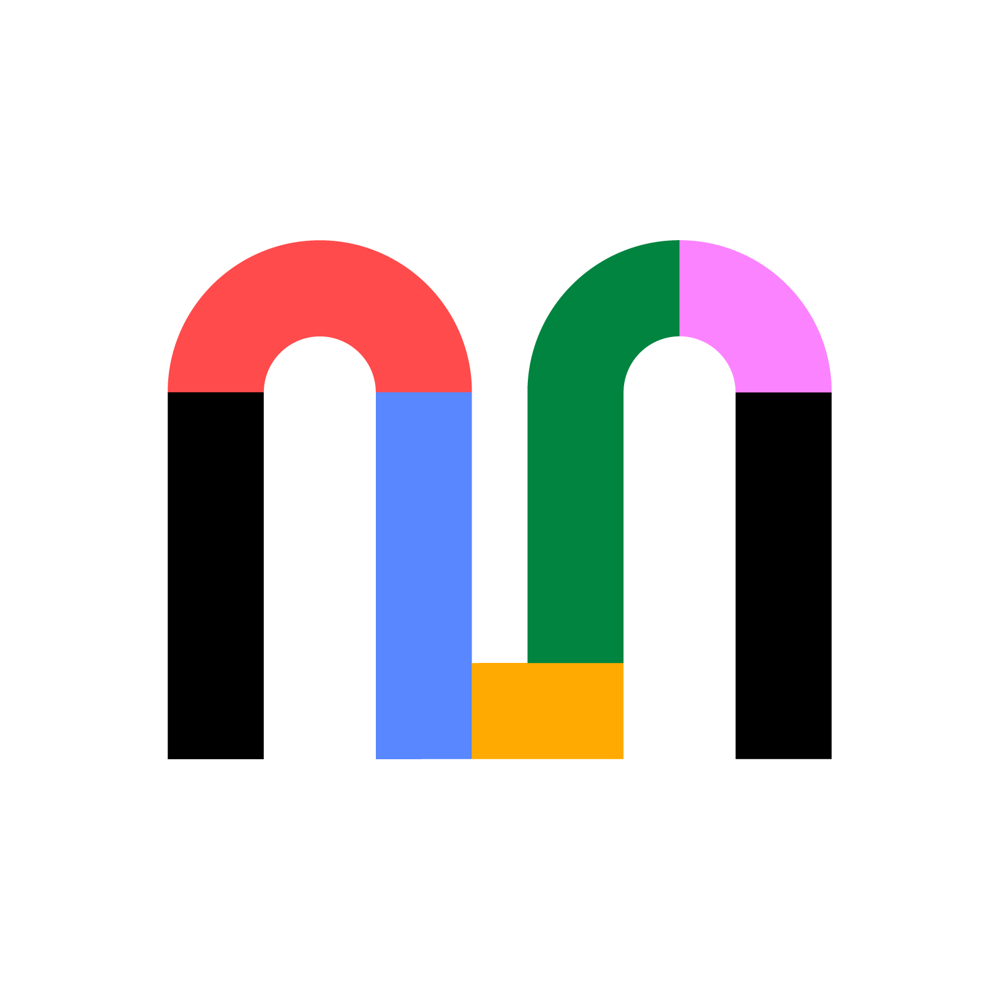

<p align="center">
  <a href="https://www.mural.co">
    
  </a>
  <h1 align="center">Agent Toolkit</h1>
</p>

Connect AI agents to [Mural](https://www.mural.co).

---

## Features

- **Mural MCP server** — Edit your murals and create new content directly from your agent by connecting via one of the plugins below. Canonical server address in `mcp.json`.
- **Cursor plugin** — Available on the Cursor Marketplace.
- **Agent Plugin** — the root `plugin.json` follows the vendor-neutral [Agent Plugins](https://agent-plugins.org) standard.

---

## Install

### Cursor plugin

1. Open **Cursor Settings → Plugins**.
2. Search for **Mural**.
3. Click **Install**, then complete the Mural sign-in prompt in your browser.

Or run `/add-plugin mural` in chat.

---

## Authentication

Mural MCP uses OAuth. There are no tokens or API keys to configure — on first connect your client opens a browser, you sign in with your Mural account, and the agent then acts on your behalf. Access is scoped to the murals your Mural user can already reach.

---

## Local development

To test the plugin before submitting:

#### Cursor

```bash
rsync -a --delete --exclude .git ./ ~/.cursor/plugins/local/mural/
```

Restart Cursor, then confirm the plugin appears under **Customize** and its tools resolve against the live server.

---

## Troubleshooting

### The plugin installs but never asks you to authenticate

If the plugin loads and lists its MCP server, but no **Authenticate** link appears and nothing
connects, check whether you already have the same server URL configured as a personal MCP server
in `~/.cursor/mcp.json`.
